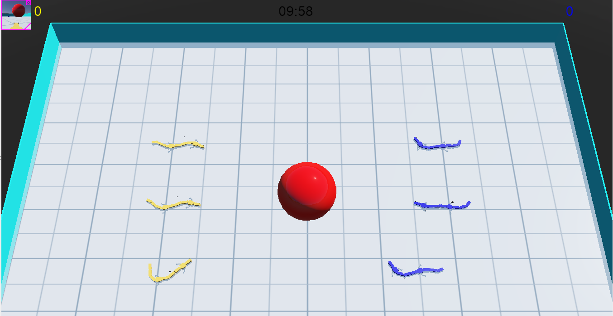

## 実行方法

### 1. salamander



kadai_0414_salamander.wbtをwebotsで開く

### 2. bioloid


bioloid_dog_in_pool.wbtをwebotsで開く

bioroid/controllers/bioloid_dog_in_pool/Robot.cppのl.50以下の
```python
//please switch following two modes (robot->swimming() or robot->swimming2())
```
の部分を編集し、robot->swimming()かrobot->swimming2()の一方を選択してコメントアウトすることで、
バタ足と両腕、脚を回転するモードを切り替えることができる。

### 2. kxr


それぞれ別のターミナルで
```bash
roslaunch webots_ros webots.launch world:=$(pwd)/my-gc-kxrl4_urdf_ros_with_two_propellers.wbt
```
としてシミュレータを立ち上げ、
```bash
ROS_NAMESPACE=/kxrl4_urdf python motion_with_two_propellers.py
ROS_NAMESPACE=/kxrl4_urdf python ../scripts/main_with_two_propellers.py
roslaunch sample_recognition.launch
rosrun smach_viewer smach_viewer.py
```
と実行しノードを上げる。
ノードの実行については、catkinワークスペースのsrc以下で
```bash
git clone https://github.com/Utaro-M/webots_pkg.git
catkin build webots_pkg
```
としてビルドした後、
```bash
roslaunch webots_pkg motion_and_main_with_two_propellers.launch
```
でまとめて実行可能である。

#### kxr 実行時の注意
kxrロボットが着水した状態でプロペラを回すと、彼方へ飛んでいってしまうバグを解消できていないため、worldファイルを開いてシミュレーションを開始した後、一度シミュレーションを止めてkxrを空中に浮かせてやり、その間にノードを上げた後、再度シミュレーションを開始するという手順が必要となっている。

